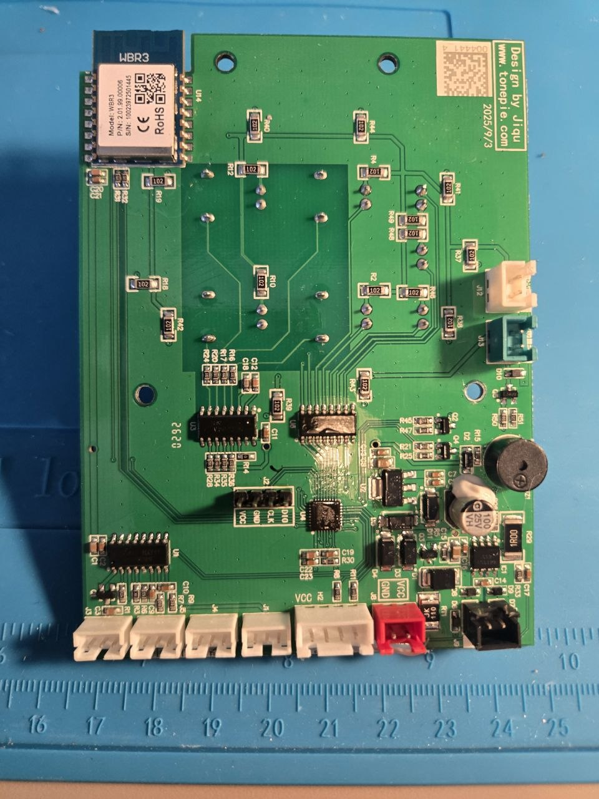
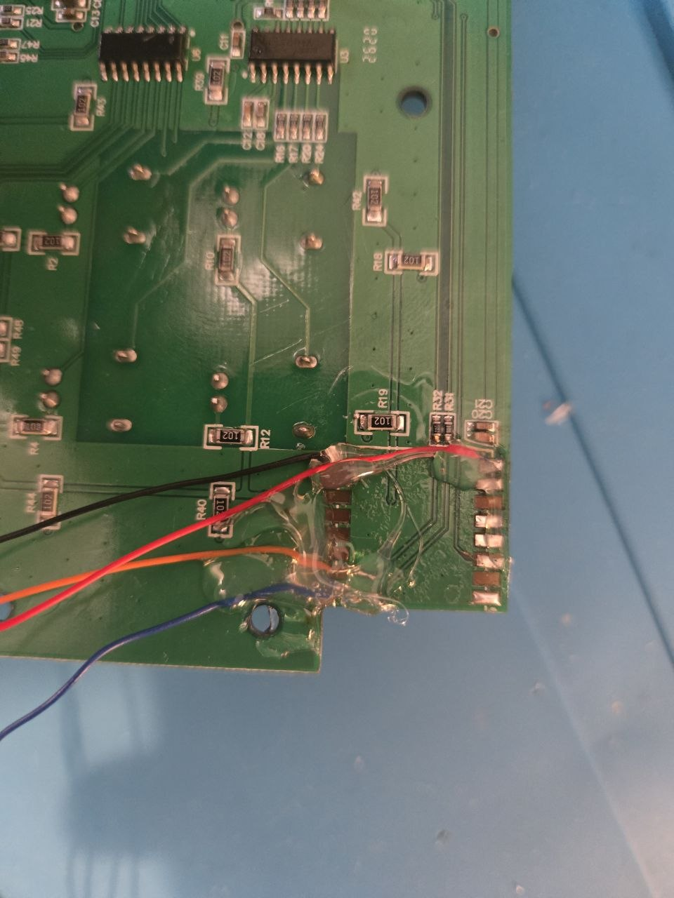
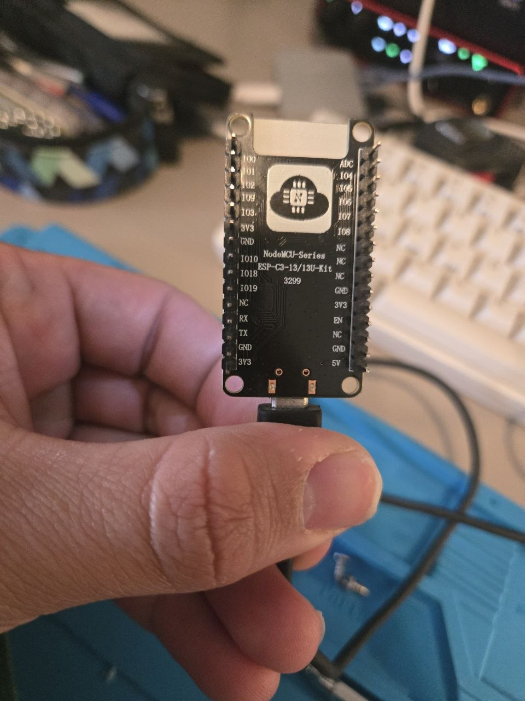
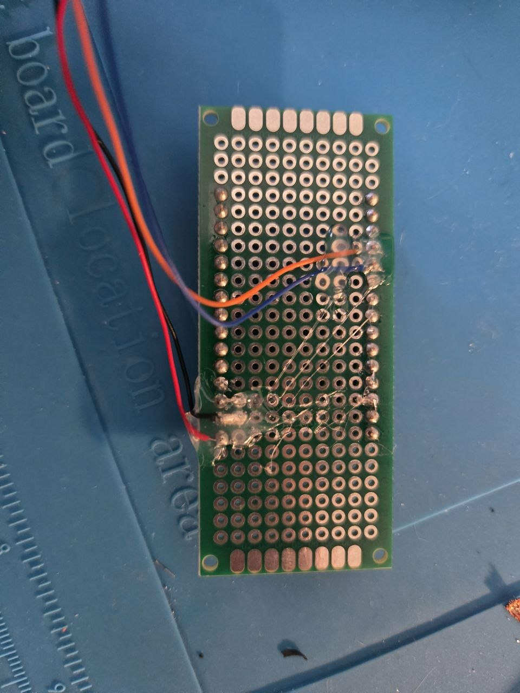

# Tonepie Ti Pro 25 — local ESP32-C3 firmware

Replace the Tuya Wi-Fi module (WBR3) of a **Tonepie Ti Pro 25 / TPCBP-T2501** self-cleaning litter box with an ESP32 (here an **Ai-Thinker ESP-C3-13-Kit**; any ESP32 or ESP8266 module fits electrically, see [Other boards](#other-boards)), and run it completely locally: no Tuya cloud, no app, no account. The original MCU keeps driving motors, sensors and safety logic; the ESP32-C3 only speaks the Tuya MCU serial protocol to it and serves a web interface on your LAN.

| | |
|---|---|
| **Home page** (`/`) | Cats recognised by weight, visits today and over the last 7 days, weight trend chart, waste-bin estimate, recent visits, maintenance buttons, litter box settings |
| **Developer page** (`/dev`) | Raw datapoints, serial log, parser statistics, guarded manual commands, firmware update, Wi-Fi settings |
| **Updates** | Over the air from the LAN (`tools/ota.py` or the `/dev` page) |
| **Recovery** | Own Wi-Fi network `Tonepie-Setup` when the home Wi-Fi is unreachable |

The web pages are in Italian (they were written for one household). All code, comments and documentation are in English.

> **Status.** The firmware runs on the real unit: handshake, datapoint reads and the pages are verified. Physical commands (clean, empty, level, bag change), the settings writes and the visit detection have **not** been exercised with the litter box assembled yet. See [VALIDATION.md](VALIDATION.md) for exactly what was and was not tested.

## The hardware modification

### Parts

- Ai-Thinker **ESP-C3-13-Kit** (also sold as NodeMCU ESP-C3-13/13U-Kit). It has a CH340 USB-serial converter on board, used for the first flash and for logs. This is the board used here; see [Other boards](#other-boards) for alternatives.
- Four thin wires, a soldering iron, some hot glue or tape, optionally a small perfboard as an adapter.
- A multimeter for continuity checks.

### Step 1 — open the litter box and locate the WBR3

The main board is marked *Design by Jiqu, www.tonepie.com*. The Tuya **WBR3** module sits in the top-left corner (`U14`).



### Step 2 — remove the WBR3

Desolder the module (hot air, or low-melt solder / a wide tip and patience). Only four of its pads are needed afterwards:

| WBR3 pad | Meaning from the main board's point of view |
|---|---|
| `3V3` | 3.3 V supply for the module |
| `GND` | ground |
| `RXD` | **MCU TX**: the MCU talks to the module on this trace |
| `TXD` | **MCU RX**: the module talks to the MCU on this trace |

The labels `RXD`/`TXD` are from the removed module's point of view, so they are the *opposite* of what you connect on the ESP side. Identify the pads with the [WBR3 datasheet](https://developer.tuya.com/en/docs/iot/wbr3-module-datasheet?id=K9dujs2k5nriy) and confirm `GND` and `3V3` with a continuity check against the board's `GND` and `VCC` test points before soldering anything.

### Step 3 — solder four wires to the pads



Red and black are the supply pair, orange and blue are the UART pair. The wires are fixed with hot glue so they cannot lift the pads.

### Step 4 — connect the ESP-C3-13-Kit



| WBR3 pad | ESP-C3-13-Kit pin |
|---|---|
| `RXD` (MCU TX) | **IO6** — UART1 RX |
| `TXD` (MCU RX) | **IO7** — UART1 TX |
| `GND` | `GND` |
| `3V3` | `3V3` |

Everything is 3.3 V logic: no level shifting, no RS-232. **Do not use the kit's `RX`/`TX` pins (GPIO20/21)**: they are wired to the on-board CH340 and are needed for USB flashing and logs. GPIO6/7 are free on this kit; keep them clear of anything else (JTAG probes included).

In this build the ESP is powered from the litter box's 3.3 V through the WBR3 `3V3` pad, so it starts and stops together with the litter box. When you plug the kit's micro-USB into a computer while the litter box is powered, two supplies meet on the 3.3 V rail; the author's unit tolerated it, but the safer routine is to power the board from one source at a time and to use the over-the-air update once the first flash is done.

A small perfboard makes a convenient adapter between the four wires and the kit's header:



### Step 5 — first flash over USB, then everything over the air

See [Building and flashing](#building-and-flashing). After the first flash, updates go over Wi-Fi.

### Other boards

Electrically the modification is the same for any ESP module: the litter box needs four wires — 3.3 V, GND and a 3.3 V UART pair — and nothing else. Any **ESP32** family board (ESP32, ESP32-S2/S3, ESP32-C3/C6) or **ESP8266** board can take the place of the WBR3; use a board with a USB-serial converter unless you are comfortable flashing with an external adapter.

What changes is the firmware side:

| Board | Firmware status |
|---|---|
| ESP-C3-13-Kit (ESP32-C3) | the tested target, `platformio.ini` env `tonepie-c3` |
| other ESP32 family boards | should build with a new `[env:...]` (board id, and `MCU_RX`/`MCU_TX` in `include/config.h` set to two free pins). Not tested; use a spare UART, keep the pins wired to the USB converter for flashing and logs, and avoid strapping pins |
| ESP8266 (NodeMCU, Wemos D1 mini, …) | **needs a port**: the code uses ESP32-only libraries (`Preferences`, `Update`, `ESPmDNS`, `HardwareSerial(1)`, hardware random). The ESP8266 also has a single full UART, so the MCU would take `Serial` and USB logging would be lost. Not done yet |

The MCU protocol, the pages and the logic are board-independent; only `src/main.cpp` and `platformio.ini` touch the hardware.

## Building and flashing

Requirements: [PlatformIO](https://platformio.org/) (CLI or VS Code extension). The project pins `espressif32@6.10.0` (Arduino core 2.0.17) and `ArduinoJson 6.21.5`.

1. Copy `include/secrets.example.h` to `include/secrets.h` and fill in your Wi-Fi SSID, Wi-Fi password and an update password of your choice. `secrets.h` is ignored by git; the passwords end up only in the compiled firmware.
2. Build:

   ```sh
   pio run -e tonepie-c3
   ```

3. First flash, over the kit's micro-USB (CH340). Find the port with `pio device list`, then:

   ```sh
   pio run -e tonepie-c3 -t upload --upload-port COM6
   ```

   If the chip does not enter the bootloader, hold `BOOT`, tap `RESET`, release `BOOT`.

4. Logs (115200 baud, same port; close the monitor before flashing again):

   ```sh
   pio device monitor --port COM6 --baud 115200
   ```

5. Open `http://tonepie.local` — or the IP shown in the log / your router — from a phone or computer on the same 2.4 GHz network. With a FRITZ!Box router, `http://tonepie.fritz.box` also works.

### Updating over the air

```sh
pio run -e tonepie-c3
python tools/ota.py                     # default: http://192.168.178.94 and the last build
python tools/ota.py http://<address> <file.bin>
```

The script reads the update password from `include/secrets.h`, uploads the image, waits for the reboot and prints the new version. The same can be done from the `/dev` page (section *Aggiornamento firmware via rete*). The image goes to the spare OTA partition and is verified before it becomes bootable, so an interrupted upload leaves the running firmware untouched. Cats, visits, weights and settings are kept.

### If the home Wi-Fi disappears

After 3 minutes without a connection (router replaced, password changed, network down) the module opens its own network:

- SSID **`Tonepie-Setup`**, password = the Wi-Fi password compiled into the firmware;
- open **`http://192.168.4.1`** (home) or **`http://192.168.4.1/dev`**;
- from `/dev` upload a firmware or enter the new home Wi-Fi credentials (section *Rete Wi-Fi*, update password required). Wrong credentials simply bring the recovery network back after 3 minutes.

The recovery network switches itself off as soon as the home Wi-Fi is back and nobody is connected to it. Credentials saved from `/dev` override the compiled ones and survive updates. Bluetooth is deliberately not used: the C3 only has BLE, which would need a dedicated app for updates.

## Using the home page

1. Tap the gear and enter each cat's name and weight (up to four). The reference weight follows the cat over time: every recognised visit moves it one fifth of the way towards the measured value.
2. Visits appear in the list as they happen. Tap one to correct the cat (or delete it if it was not a visit); corrections also teach the new weight.
3. The **waste bin** card shows the estimate described below; **Cambio sacchetto** (bag change) resets it and tells the MCU about the new bag.
4. **Pulisci ora** starts a cleaning cycle; **Aggiunta lettiera** (litter added) records the date and asks the MCU to level the litter. Both ask for confirmation and are refused when a cat is detected inside, a fault is active or the child lock is on.
5. The *Lettiera* section of the settings changes three values kept by the MCU: automatic cleaning, the delay before cleaning (0–60 min) and automatic deodorising after cleaning. Only changed values are sent, and the page checks that the MCU reports them back.

The **weight trend** chart plots each cat's daily average weight over 30 or 90 days, with a table view for the exact values.

### Cat recognition

A visit's weight is compared with the reference weights: the nearest cat within the tolerance (default 0.5 kg) wins; a tie or a reading outside the tolerance leaves the visit *unrecognised* for you to assign by hand. The MCU reports the weight either in grams or in 0.1 kg steps depending on the model; both are accepted. Two cats closer than ~0.3 kg cannot be told apart reliably.

### Visit detection

Per the community mapping, the MCU reports three things around a visit: the day's visit counter (DP7), the cat weight (DP6) and the visit duration (DP8). Their order and timing on the real unit are not verified, so any of them opens a visit and the others are merged if they arrive within 15 minutes; values repeated inside a query response never create visits, and visits missed while the ESP was off are recovered from the counter at boot. Logic in `include/litter_logic.h`, tests in `test/litter_test.cpp`.

### The waste-bin estimate, and why it is an estimate

The Tuya protocol exposes **no scale reading**: the MCU only sends the cat's weight after a visit, and there is no command to read the load cells. The bin content is therefore *visits × grams per visit* (default 50 g, configurable), shown as an estimate. Measuring waste for real (weight before and after each visit, and total since the last bag change) needs the ESP to listen directly to the HX711 load-cell amplifier on the main board; that extension is planned but not part of this firmware yet. The MCU's own bin-full logic (based on the number of cleanings, DP123/124) is untouched and keeps working.

## Datapoints

Verified on this unit: the UART handshake, and the *types* of the datapoints below. Meanings come from the community configuration for the Ti Pro25 in [tuya-local](https://github.com/make-all/tuya-local/blob/main/custom_components/tuya_local/devices/ti_pro25_catlitterbox.yaml) and from [issue #6071](https://github.com/make-all/tuya-local/issues/6071); [issue #1541](https://github.com/make-all/tuya-local/issues/1541) documents a related model with partly different numbering.

| DP | Type seen | Community meaning | Firmware use |
|---|---|---|---|
| 6 | — (after a visit) | cat weight | recognition, weight chart |
| 7 | VALUE | visits per day | visit detection |
| 8 | — (after a visit) | visit duration, s | visit list |
| 22 | BITMAP | fault bits | status, command veto |
| 24 | ENUM | state (index order unknown) | shown raw on `/dev` |
| 101 | BOOL | clean | **write** `true` |
| 102 | BOOL | empty all litter | **write** `true` (`/dev` only) |
| 104 | — | cat presence | command veto |
| 105 | BOOL | auto clean | **write** on/off |
| 114 | BOOL | child lock | command veto |
| 117 | VALUE | delay before cleaning, min | **write** 0–60 |
| 118 | VALUE | cleaning interval, min | **write** 0–120 (`/dev` only) |
| 123 / 124 | VALUE | bin-full calibration / cleanings | shown raw |
| 126 | never reported | level litter (button) | **write** `true` |
| 127 | BOOL | bag replaced (button) | **write** `true` |
| 129 | BOOL | deodorise after cleaning | **write** on/off |
| others | various | not assumed | read-only |

Only the eight DPs marked **write** can be written, each through a dedicated endpoint with a fixed type. No generic DP write, no MCU reset (DP113), no calibration (DP115), no firmware update of the MCU.

## Safety model

- Motors and sensors stay under the original MCU. The ESP never drives a GPIO of the litter box and never simulates a sensor.
- A write requires: a recent heartbeat, completed initialisation, the target DP reported with the expected type in the last 60 s (except the never-reported DP126), no pending command, 2 s since the previous write, and a send session enabled from the page. The home page enables a session only for the duration of one confirmed action.
- Anything that may move the drum is additionally refused while the MCU reports a cat inside, a fault or the child lock. These checks **do not prove the litter box is empty**; the MCU's own protections remain the real safeguard.
- "Sent" means the frame left the UART. "Confirmed" means the MCU reported the requested value, not that the movement completed. Nothing is retried automatically.
- The HTTP interface is for a trusted home network: no accounts, no TLS. A per-boot token and a Host check stop cross-site requests from a browser; they do not authenticate LAN clients. Firmware upload and Wi-Fi changes additionally require the update password. Do not expose port 80 to the Internet.
- The network state told to the MCU is `4` ("connected") once Wi-Fi is up, otherwise the MCU keeps its Wi-Fi LED blinking. Nothing ever connects to the Tuya cloud. Local time from NTP is given to the MCU when it asks.

## Protocol notes

Frames `55 AA`, module version `00`, MCU version `03`, big-endian length, checksum = sum mod 256, payload up to 1024 bytes. Heartbeat every 1 s until online, then every 5 s; link lost after 15 s. Init sequence: heartbeat → product info (`01`) → working mode (`02`) → network state (`03`) → query (`08`). MCU reset detected from a heartbeat reply of `00`. Pairing requests (`04`/`05`) are acknowledged without touching credentials. The parser recovers from noise, bad checksums, oversized lengths and truncated frames, and validates a whole DP report before applying it.

First contact capture: `diagnostics/mcu-first-contact.json` (product id `yn6wqmizg7abe5k8`, MCU firmware 1.0.15).

## Project layout

```text
platformio.ini             pinned platform and dependencies
include/config.h           pins, timings, network names
include/secrets.example.h  template for secrets.h (passwords, not in git)
include/tuya_protocol.h    Tuya MCU frame encoder/parser, Arduino-independent
include/litter_logic.h     cat matching, visit detection, weight log, Arduino-independent
include/web_home.h         home page (embedded HTML, Italian)
include/web_ui.h           developer page (embedded HTML, Italian)
src/main.cpp               UART, init, HTTP API, NVS storage, OTA, recovery network
test/protocol_test.cpp     host tests for the protocol
test/litter_test.cpp       host tests for recognition and visit detection
tools/ota.py               over-the-air update
tools/preview.py           local preview of the pages with fake data
diagnostics/               first-contact capture from the real MCU
docs/images/               photos of the modification
```

Host tests (any C++11 compiler):

```sh
g++ -std=c++11 -Wall -Wextra -pedantic -Iinclude test/protocol_test.cpp -o protocol_test && ./protocol_test
g++ -std=c++11 -Wall -Wextra -pedantic -Iinclude test/litter_test.cpp -o litter_test && ./litter_test
```

Page preview without hardware: `python tools/preview.py`, then open `http://localhost:8765` (`/mock/empty` and `/mock/full` switch scenarios).

## HTTP API

All `POST` requests need the `X-Tonepie-Token` header with the token returned by `GET /api/state` or `GET /api/home`; `/api/update` and `/api/wifi` also need `X-Tonepie-Ota`.

| Endpoint | Purpose |
|---|---|
| `GET /api/home` | data for the home page |
| `GET /api/state` | raw datapoints, log, parser statistics |
| `POST /api/config` | cats and estimate settings (JSON body) |
| `POST /api/visit` | reassign or delete a visit (`id`, `cat` or `delete`) |
| `POST /api/bin/reset`, `POST /api/litter` | record a bag change / litter top-up |
| `POST /api/arm` | enable sends for 10 minutes (`enabled=1/0`) |
| `POST /api/query` | ask the MCU for all datapoints |
| `POST /api/command` | `clean`, `empty`, `auto_on`, `auto_off`, `odor_on`, `odor_off`, `bag`, `level` |
| `POST /api/value` | `dp=117|118`, `value` in minutes |
| `POST /api/update` | firmware image (multipart) |
| `POST /api/wifi` | new Wi-Fi credentials, then reboot |

## Sources

- [Tuya Wi-Fi MCU serial protocol](https://developer.tuya.com/en/docs/iot/mcu-protocol?id=K9hrdpyujeotg)
- [tuya-local: Ti Pro25 device configuration](https://github.com/make-all/tuya-local/blob/main/custom_components/tuya_local/devices/ti_pro25_catlitterbox.yaml), [issue #6071](https://github.com/make-all/tuya-local/issues/6071), [issue #1541](https://github.com/make-all/tuya-local/issues/1541)
- [Ai-Thinker ESP-C3-13-Kit specification](https://iot-kmutnb.github.io/blogs/esp32/esp32_c3_ai_thinker/esp-c3-13-kit-v1.0_spec.pdf)
- [Tuya WBR3 module datasheet](https://developer.tuya.com/en/docs/iot/wbr3-module-datasheet?id=K9dujs2k5nriy)
- [Arduino-ESP32 serial API](https://docs.espressif.com/projects/arduino-esp32/en/latest/api/serial.html)

This is a hobby project for one litter box. It is not affiliated with Tonepie or Tuya. Modifying the appliance voids its warranty; you do it at your own risk, and the first tests of any movement should be supervised and without a cat nearby.
